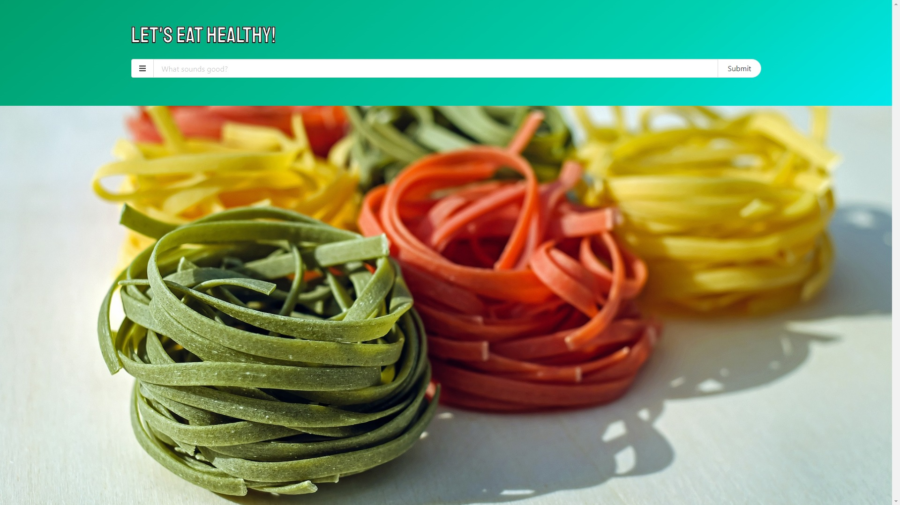
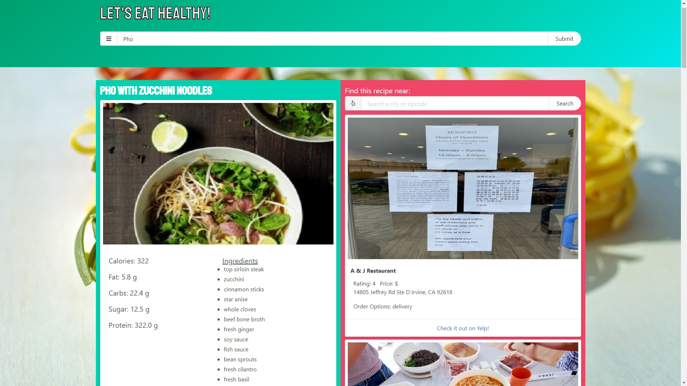

--- Nutri Spot README ---

This is the link to the GitHub Repo:
https://github.com/jdmarty/scoop

This is the link to the live page:
https://jdmarty.github.io/scoop/

Link to Spoonacular API:
https://rapidapi.com/spoonacular/api/recipe-food-nutrition/details

Link to Yelp API:
https://www.yelp.com/developers/documentation/v3/get_started

--- Why Nutri Spot ---

This app was inspired by people who are interested in quality meals and that want options to either cook themselves or swing by a restaurant for some take-out. Motivation to build this came from our passion for quality food and to show users that there are other options besides Mickey D’s drive through.

Nutri Spot incorporates Spoonacular’s API to search for healthy food, their nutritional data, and the ingredients one would need to make that meal. Additionally, Nutri Spot uses data retrieved from Spoonacular and incorporates Yelp’s API to display nearby restaurants that serve similar dishes. 

If time is plentiful and the user would like to prepare their meal, they’ll have a list of items needed to do so. If time is limited, they’ll know who to call, and where to depart to.

--How To Use---
- Search a simple type of food (eg pizza, noodles, chicken, etc) in the search bar at the top of the page
- Select one of the buttons that populate below the search bar to see nutritional information and yelp results for that recipe
- Click "Back to Results" to go back to the original search
- Before running a search, click the menu button on the left side of the search bar to see and set advanced search terms
NOTE: this will restrict your searches and may results in a limited number of results

--- What Nutri Spot Looks Like ---

Thank you for viewing and we hope you enjoy the app!